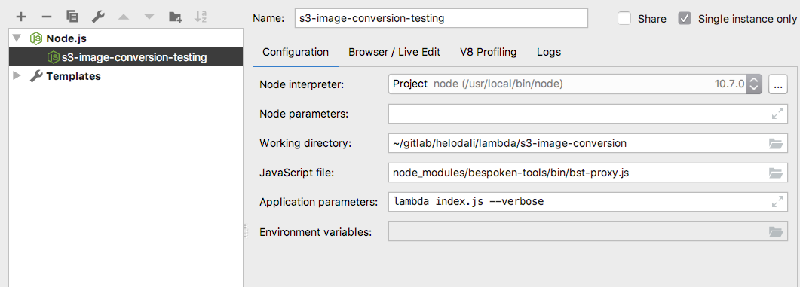

# Installing the image-conversion Lambda function

See the scripts/create-function.sh script for the function parameters. This script can be used to
create the function but it does not include the trigger assignments. Existing triggers on the
helodali-raw-images need to be removed before reassigning to a recreated image-conversion function.

See http://sharp.dimens.io/en/latest/install/#aws-lambda for the docker build requirements.

The image-conversion.yaml may also be used to recreate or verify configuration.

## Executing Locally

The lambda can be tested locally using bespoken. 

1. Create a configuration in WebStorm like the following:

2. Run or Debug the configuration and then execute `./test-event.sh`